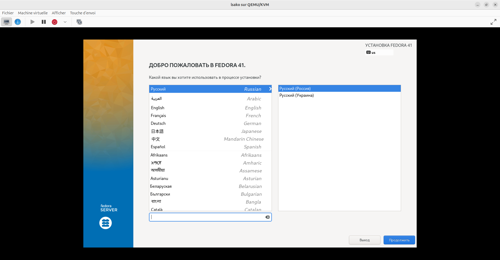
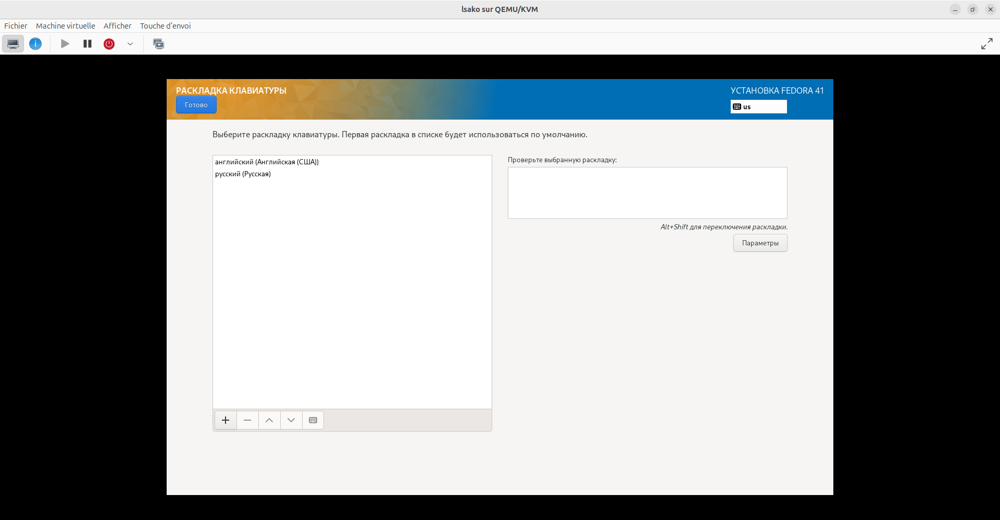
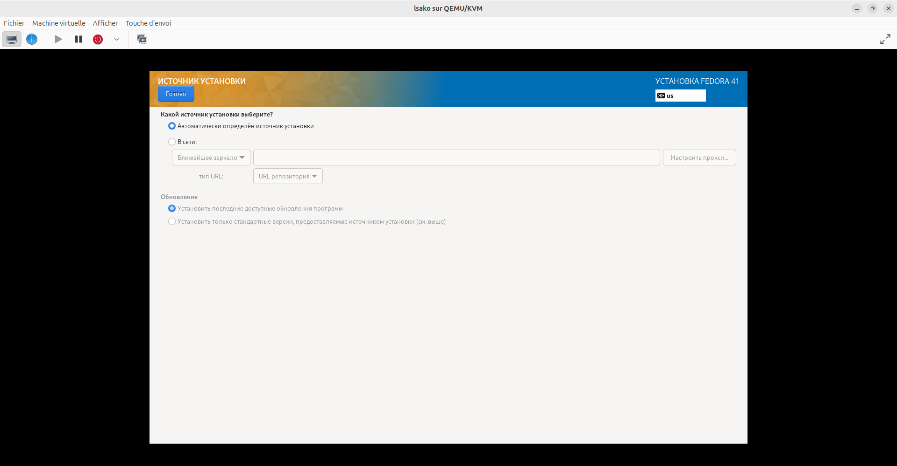
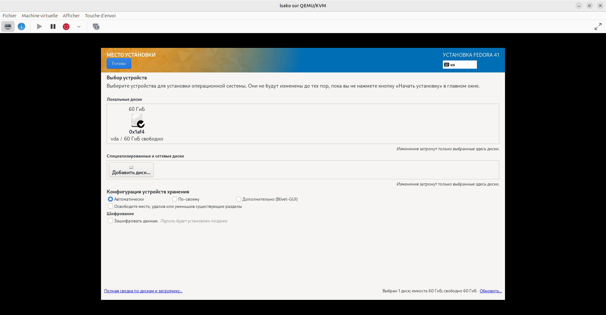
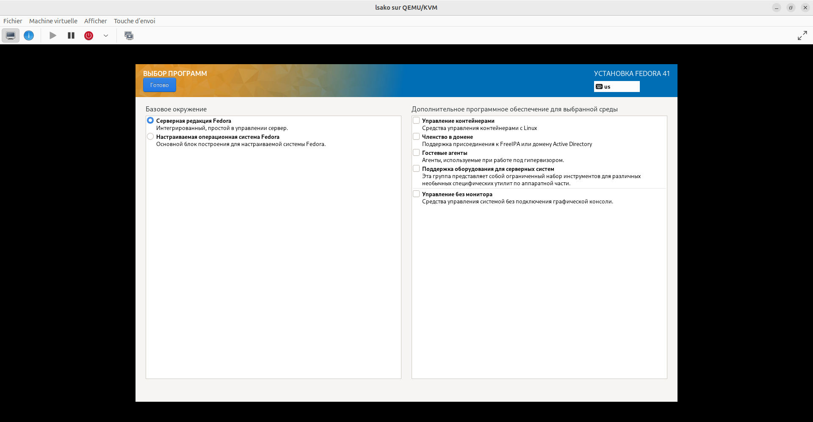
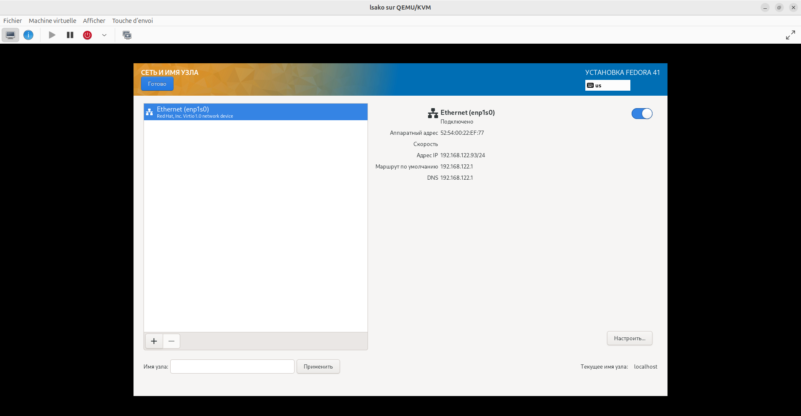
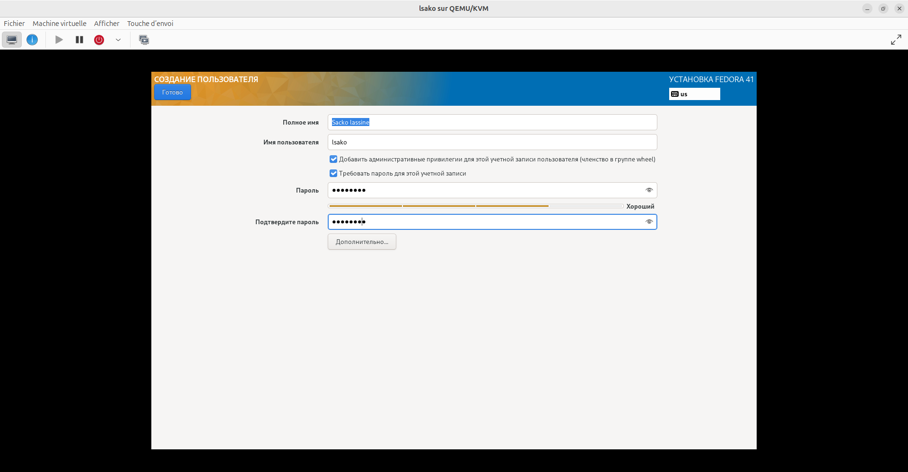
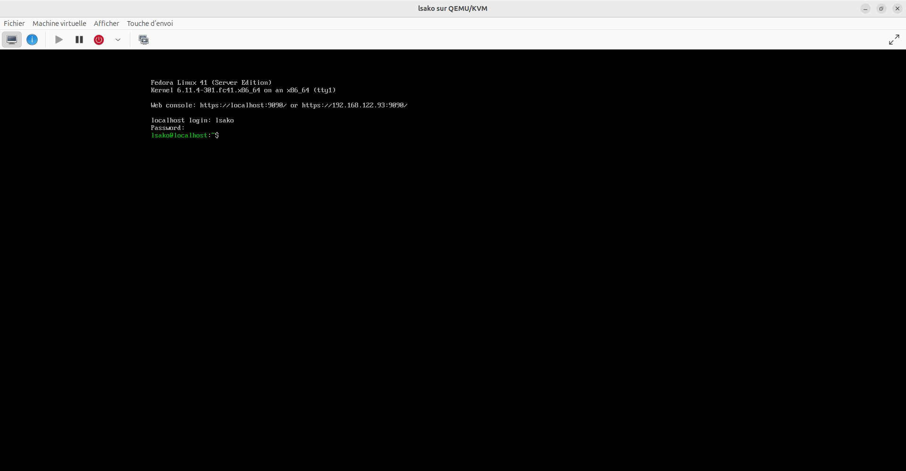
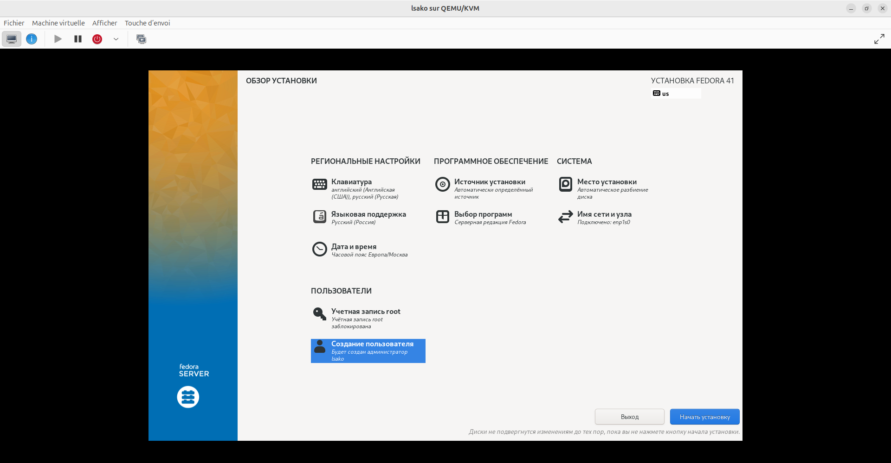

# Лабораторная работа №1: Установка ОС Linux

**Студент:** САКО ЛАССИНЕ  
**Группа:** НПИБД-02-25  
**Дата выполнения:** 20.04.2026  
**Дистрибутив:** Fedora 41 Server  
**Гипервизор:** QEMU/KVM  

---

## Цель работы

Приобретение практических навыков установки операционной системы Linux на виртуальную машину и настройки минимально необходимых для дальнейшей работы сервисов.

---

## Ход выполнения работы

### 1. Создание виртуальной машины

Была создана виртуальная машина со следующими параметрами:

| Параметр | Значение |
|----------|----------|
| Имя виртуальной машины | lsako |
| Оперативная память (RAM) | 2048 МБ |
| Количество ядер CPU | 2 |
| Объём жёсткого диска | 60 ГБ |
| Гипервизор | QEMU/KVM |

### 2. Установка операционной системы

**Настройки установки:**

| Параметр | Значение |
|----------|----------|
| Язык интерфейса | Русский |
| Раскладка клавиатуры | английский (США), русский |
| Часовой пояс | Европа/Москва |
| Имя пользователя | lsako |
| Тип установки | Серверная редакция Fedora |

#### Скриншоты процесса установки

**Выбор языка установки:**



**Настройка раскладки клавиатуры:**



**Выбор источника установки:**



**Выбор диска для установки:**



**Выбор программного обеспечения:**



**Настройка сети и имени узла:**



**Создание пользователя:**



**Обзор перед установкой:**


**Экран входа в систему после установки:**



**Терминал после входа:**


### 3. Информация о системе (dmesg)

После установки и первого входа в систему были выполнены следующие команды:

```bash
uname -a
sudo dmesg | grep "Linux version"
sudo dmesg | grep "Detected Mhz"
sudo dmesg | grep "CPU0"
sudo dmesg | grep "Memory"
sudo dmesg | grep "Hypervisor detected"
df -h

## Результаты выполнения команд:



| Параметр | Значение |
|----------|----------|
| Версия ядра | 6.11.4-301.fc41.x86_64 |
| Частота процессора | 806.400 MHz |
| Модель процессора | Intel(R) Family 6 |
| Доступная память | ~2,9 ГБ |
| Гипервизор | KVM |
| Корневая ФС | `/dev/mapper/fedora-root` |

---

## Выводы

В ходе выполнения лабораторной работы были получены следующие результаты:

1. **Установлена операционная система Fedora 41 Server** на виртуальную машину под управлением гипервизора QEMU/KVM.

2. **Произведена начальная настройка системы**:
   - Создан пользователь `lsako` с административными привилегиями
   - Настроена сетевая конфигурация
   - Выбрана русская раскладка клавиатуры

3. **Получены основные сведения о системе** с помощью команды `dmesg`.

4. **Навыки, приобретённые в ходе работы**:
   - Создание виртуальных машин в QEMU/KVM
   - Установка Linux-системы с нуля
   - Использование команды `dmesg` для диагностики системы

---

## Ответы на контрольные вопросы

### 1. Какую информацию содержит учётная запись пользователя?

Учётная запись пользователя содержит:

- **Имя пользователя (username)** — уникальное имя для входа
- **UID (User ID)** — числовой идентификатор пользователя
- **GID (Group ID)** — числовой идентификатор основной группы
- **Домашний каталог** — путь к личному каталогу
- **Командная оболочка (shell)** — программа, запускаемая при входе
- **Пароль** — хранится в зашифрованном виде в `/etc/shadow`

### 2. Команды терминала

| Действие | Команда | Пример |
|----------|---------|--------|
| Получение справки | `man <команда>` | `man ls` |
| Перемещение по ФС | `cd <путь>` | `cd /home` |
| Просмотр содержимого | `ls -la` | `ls -la ~` |
| Определение объёма | `du -sh <путь>` | `du -sh /home` |
| Создание каталога | `mkdir <имя>` | `mkdir test` |
| Удаление каталога | `rm -r <имя>` | `rm -r test` |
| Создание файла | `touch <имя>` | `touch file.txt` |
| Удаление файла | `rm <имя>` | `rm file.txt` |
| Задание прав | `chmod 755 <имя>` | `chmod 755 script.sh` |
| Просмотр истории | `history` | `history` |

### 3. Что такое файловая система? Приведите примеры.

**Файловая система** — это способ организации, хранения и именования данных на носителе информации.

**Примеры:**

- **ext4** — стандартная ФС Linux, поддерживает журналирование
- **XFS** — высокопроизводительная ФС для больших файлов
- **btrfs** — современная ФС с поддержкой снапшотов
- **NTFS** — ФС Windows
- **FAT32** — простая ФС, совместима со всеми ОС

### 4. Как посмотреть, какие файловые системы подмонтированы в ОС?

```bash
mount              # все точки монтирования
df -hT             # с информацией о занятом месте
cat /proc/mounts   # через файл proc
findmnt            # структурированный вывод


### 5. Как удалить зависший процесс?

Чтобы удалить (завершить) зависший процесс, выполните следующие шаги:

#### 1. Найти идентификатор процесса (PID)

```bash
# Поиск процесса по имени
ps aux | grep <имя_процесса>

# Или с помощью pgrep
pgrep <имя_процесса>

# Пример: найти процесс firefox
ps aux | grep firefox

### 2. Завершить процесс

```bash
# Мягкое завершение (SIGTERM)
kill <PID>

# Принудительное завершение (SIGKILL)
kill -9 <PID>

# Завершить все процессы с данным именем
killall <имя_процесса>

# Завершить по имени (pgrep + kill)
pkill <имя_процесса>

# Пример: принудительно завершить процесс firefox с PID 12345
kill -9 12345

# Пример: завершить все процессы firefox
killall firefox

### Пояснение сигналов:

| Сигнал | Номер | Описание |
|--------|-------|----------|
| SIGTERM | 15 | Мягкое завершение (по умолчанию) |
| SIGKILL | 9 | Принудительное завершение (не может быть перехвачен) |
| SIGINT | 2 | Прерывание (как Ctrl+C) |

---

## Заключение

Лабораторная работа выполнена в полном объёме. Все цели достигнуты. Система готова к дальнейшей работе и выполнению последующих лабораторных работ.

## Список литературы

- [1] GNU Project. Documentation Linux. 2024
- [2] Linux Foundation. Linux Manual Pages. 2024

