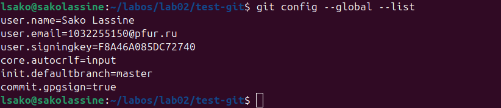
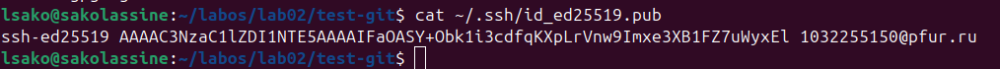
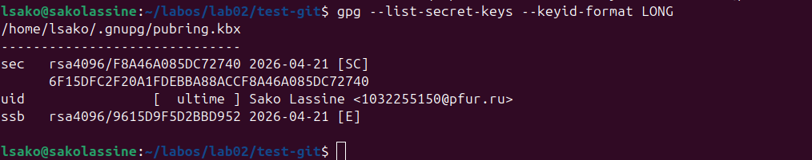
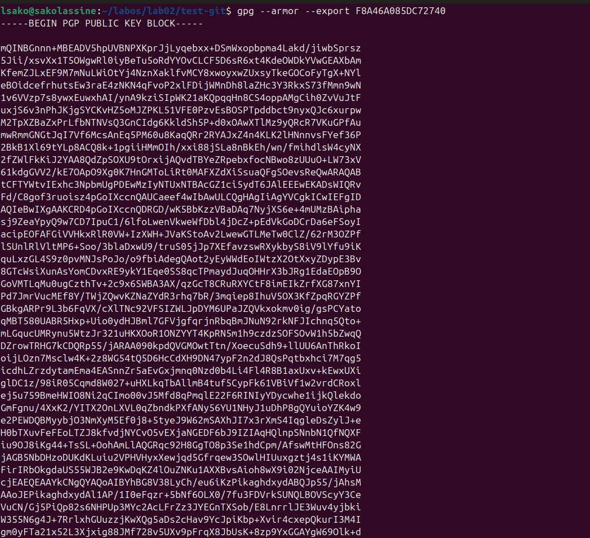
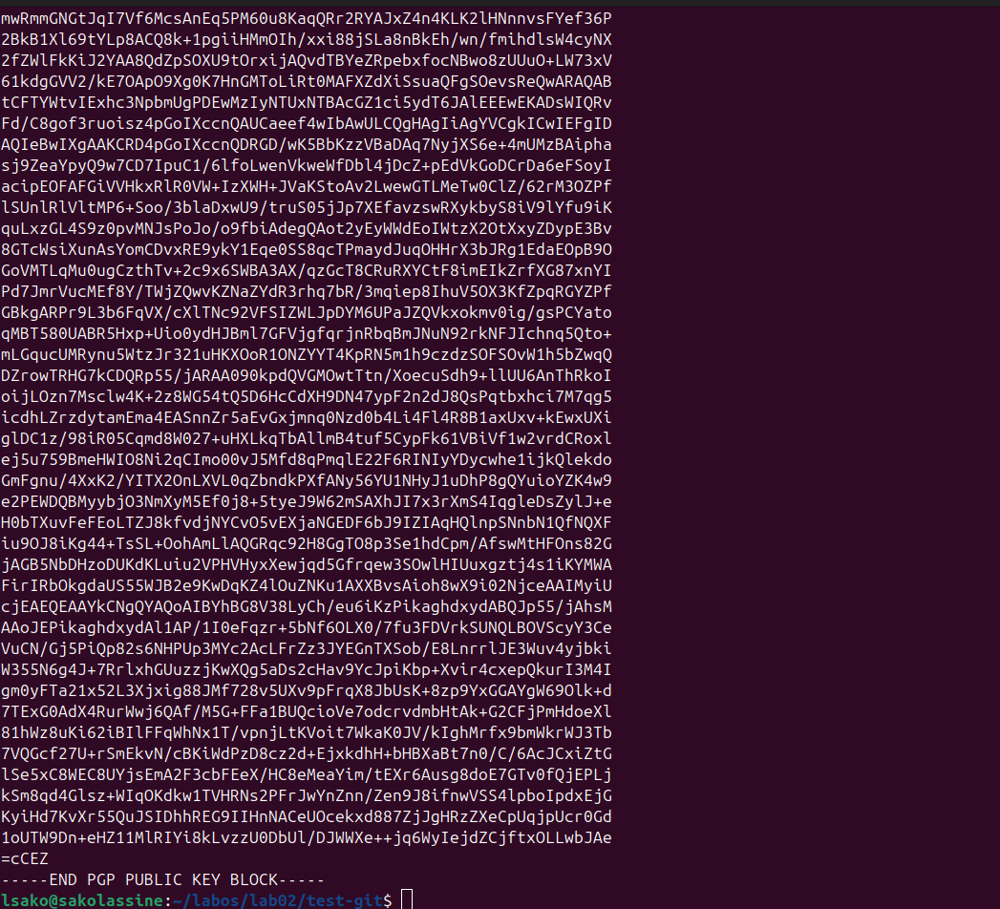
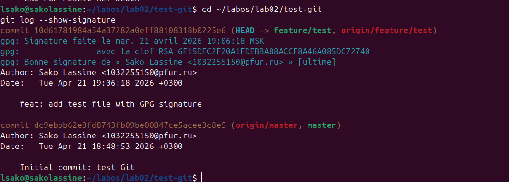
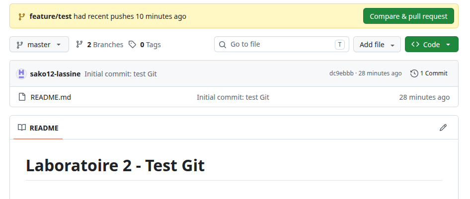

# Лабораторная работа №2: Первоначальная настройка git

**Студент:** САКО ЛАССИНЕ  
**Группа:** НПИБД-02-25  
**Дата выполнения:** 21.04.2026

---

## Цель работы

Изучить идеологию и применение средств контроля версий.  
Освоить умения по работе с git.

---

## Ход выполнения работы

### 1. Настройка конфигурации git



### 2. Создание SSH ключа



### 3. Создание GPG ключа





### 4. Проверка подписи коммита






### 5. GitHub с отметкой Verified



### 6. Отправка изменений на сервер


---

## Выводы

В ходе выполнения лабораторной работы были получены следующие результаты:

1. Установлено программное обеспечение: git и gh.
2. Выполнена базовая настройка git (имя, email, autocrlf).
3. Созданы SSH ключи для безопасного подключения к GitHub.
4. Созданы GPG ключи для подписи коммитов.
5. Настроена автоматическая подпись коммитов.
6. Создан локальный и удалённый репозиторий.
7. Выполнен коммит с GPG подписью.
8. Проверена верификация подписи на GitHub.

**Приобретённые навыки:**
- Работа с git в командной строке
- Создание и управление SSH/GPG ключами
- Работа с удалёнными репозиториями GitHub
- Подписание коммитов для обеспечения подлинности

---

## Ответы на контрольные вопросы

### 1. Что такое системы контроля версий (VCS) и для решения каких задач они предназначаются?

**Системы контроля версий** — это программные инструменты, отслеживающие изменения в файлах и каталогах проекта.

**Задачи VCS:**
- Хранение истории изменений
- Возможность отката к любой предыдущей версии
- Совместная работа нескольких разработчиков
- Разрешение конфликтов при слиянии изменений
- Создание веток для параллельной разработки

### 2. Объясните понятия VCS: хранилище, commit, история, рабочая копия

| Понятие | Описание |
|---------|----------|
| **Хранилище (repository)** | База данных, содержащая все версии файлов и историю изменений |
| **Commit** | Фиксация (сохранение) изменений в хранилище с комментарием |
| **История** | Последовательность всех коммитов, позволяющая отследить эволюцию проекта |
| **Рабочая копия** | Локальная версия файлов, с которой работает пользователь |

### 3. Централизованные и децентрализованные VCS. Примеры

| Тип | Особенности | Примеры |
|-----|-------------|---------|
| **Централизованные** | Единый центральный сервер, клиенты получают последнюю версию | CVS, Subversion (SVN) |
| **Децентрализованные** | Каждый разработчик имеет полную копию репозитория | Git, Mercurial, Bazaar |

### 4. Основные команды git

| Команда | Назначение |
|---------|------------|
| `git init` | Инициализация нового репозитория |
| `git clone` | Клонирование удалённого репозитория |
| `git add` | Добавление файлов в индекс |
| `git commit` | Фиксация изменений |
| `git push` | Отправка изменений на сервер |
| `git pull` | Получение изменений с сервера |
| `git status` | Просмотр состояния рабочего каталога |
| `git log` | Просмотр истории коммитов |
| `git branch` | Управление ветками |
| `git merge` | Слияние веток |

### 5. Что такое ветки (branches) и зачем они нужны?

**Ветки** — это независимые линии разработки, позволяющие вести параллельную работу.

**Зачем нужны ветки:**
- Разработка новых функций без влияния на стабильную версию
- Исправление ошибок в отдельных ветках
- Эксперименты без риска сломать основной код
- Параллельная работа нескольких разработчиков

### 6. Как игнорировать файлы при commit?

Создать файл `.gitignore` в корне репозитория и добавить шаблоны:

```bash
*.log
*.tmp
__pycache__/
.vscode/

### Зачем нужен .gitignore?

- **Исключить временные файлы** — файлы, создаваемые редакторами или компиляторами (например, `*.tmp`, `*.log`, `*.o`)
- **Не загружать конфиденциальные данные** — пароли, ключи API, файлы с секретами (например, `.env`, `config/secrets.yml`)
- **Уменьшить размер репозитория** — исключить большие бинарные файлы, кэш, зависимости (`node_modules/`, `__pycache__/`, `*.iso`)

---

## Заключение

Лабораторная работа выполнена в полном объёме. Все цели достигнуты.  
Настроена базовая конфигурация git, созданы SSH и GPG ключи, выполнена интеграция с GitHub. Система готовa к дальнейшей работе с системами контроля версий.

## Список литературы

- [1] GNU Project. Documentation Linux. 2024
- [2] Linux Foundation. Linux Manual Pages. 2024

