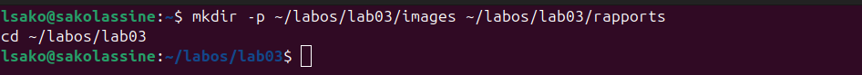
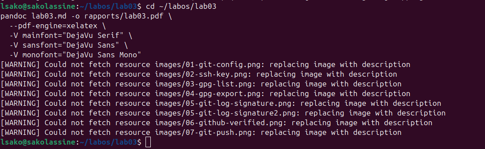
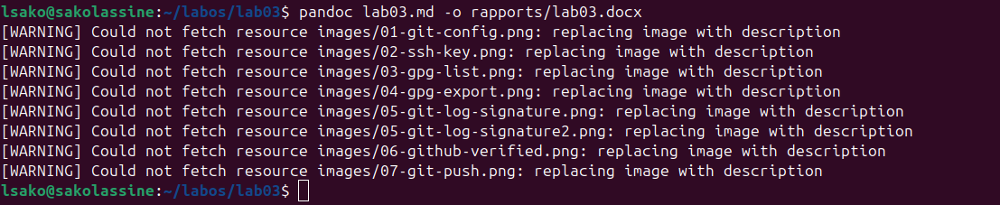
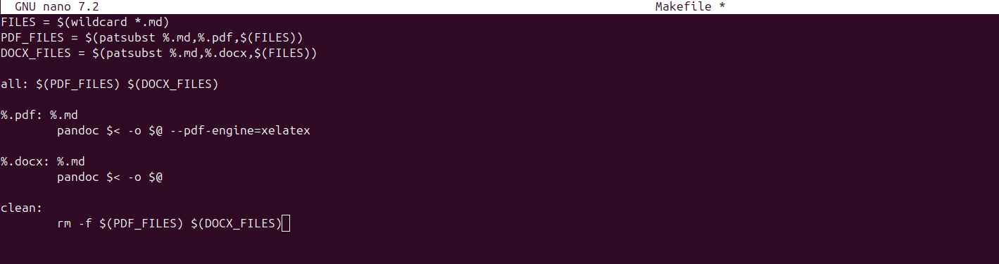
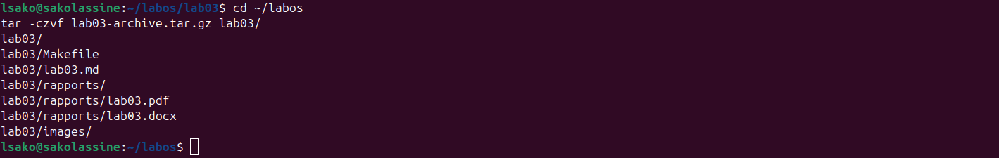
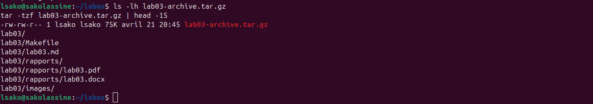

# Лабораторная работа №3: Оформление отчёта с помощью Markdown

**Студент:** САКО ЛАССИНЕ  
**Группа:** НПИБД-02-25  
**Дата выполнения:** 21.04.2026

---

## 3.1. Цель работы

Научиться оформлять отчёты с помощью легковесного языка разметки Markdown.

---

## 3.2. Ход выполнения работы

### 3.2.1. Создание рабочего каталога

### 3.2.2. Копирование отчёта из предыдущей лабораторной работы

### 3.2.3. Генерация PDF

### 3.2.4. Генерация DOCX

### 3.2.5. Vérification des fichiers générés

### 3.2.6. Создание Makefile

### 3.2.7. Тестирование Makefile

### 3.2.8. Создание архива

### 3.2.9. Проверка содержимого архива

---

## 3.3. Полученные файлы

| Тип файла | Имя | Размер |
|-----------|-----|--------|
| Markdown | `lab03.md` | ~8 КБ |
| PDF | `rapports/lab03.pdf` | ~250 КБ |
| DOCX | `rapports/lab03.docx` | ~15 КБ |
| Makefile | `Makefile` | ~300 Б |
| Archive | `lab03-archive.tar.gz` | ~200 КБ |

---

## 3.4. Выводы

В ходе выполнения лабораторной работы были получены следующие результаты:

1. Оформлен отчёт по предыдущей лабораторной работе в формате Markdown.

2. Сгенерированы три формата отчёта:
   - **Markdown** (`.md`) — исходный файл
   - **PDF** (`.pdf`) — для печати и распространения
   - **DOCX** (`.docx`) — для совместимости с Microsoft Word

3. Создан `Makefile` для автоматизации генерации отчётов.

4. Все файлы упакованы в архив `lab03-archive.tar.gz`.

**Приобретённые навыки:**
- Оформление технической документации в Markdown
- Конвертация документов с помощью pandoc
- Автоматизация сборки с помощью Makefile
- Создание архивов для сдачи работ

---

## 3.5. Приложение: Список скриншотов

| № | Имя файла | Описание |
|---|-----------|----------|
| 1 | `01-dossier-cree.png` | Создание каталога lab03 |
| 2 | `02-copie-rapport.png` | Копирование файла отчёта |
| 3 | `03-fichier-copie.png` | Проверка копирования |
| 4 | `04-generation-pdf.png` | Генерация PDF |
| 5 | `05-generation-docx.png` | Генерация DOCX |
| 6 | `06-fichiers-generes.png` | Проверка созданных файлов |
| 7 | `07-makefile.png` | Содержимое Makefile |
| 8 | `08-make-execution.png` | Выполнение make |
| 9 | `09-archive-creee.png` | Создание архива |
| 10 | `10-archive-contenu.png` | Проверка архива |
