# Лабораторная работа №5: Менеджер паролей pass и управление файлами конфигурации

**Студент:** САКО ЛАССИНЕ  
**Группа:** НПИБД-02-25  
**Дата выполнения:** 22.04.2026

---

## Цель работы

Получение навыков работы с менеджером паролей pass и управлением файлами конфигурации с помощью chezmoi.

---

## Ход выполнения работы

### 1. Установка pass и gopass

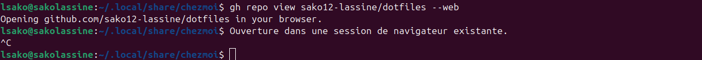

### 2. Просмотр GPG ключей

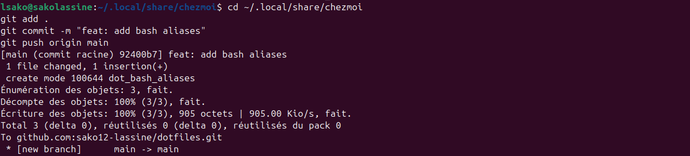

### 3. Создание GPG ключа

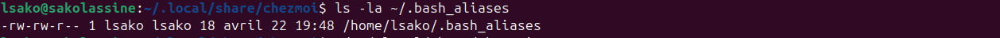

### 4. Инициализация pass

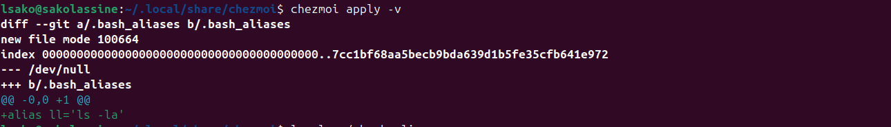

### 5. Git init в pass

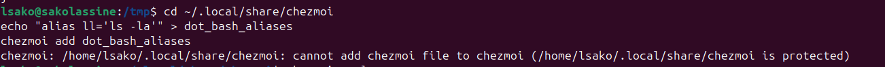

### 6. Добавление пароля

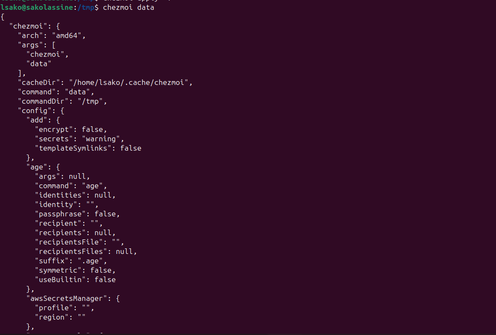

### 7. Просмотр пароля

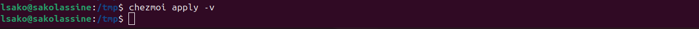

### 8. Установка chezmoi

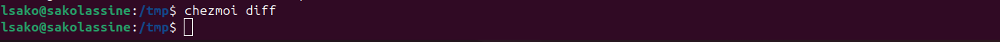

### 9. Версия chezmoi

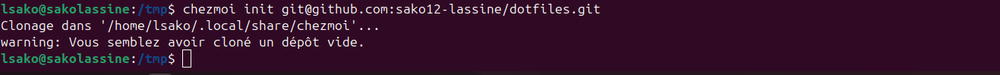

### 10. Создание репозитория dotfiles

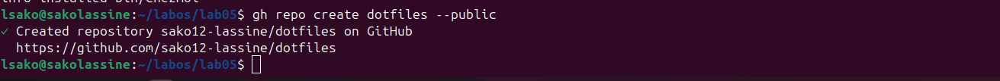

### 11. Инициализация chezmoi

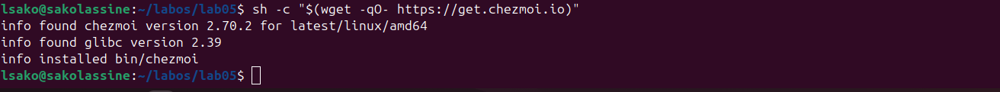

### 12. Данные chezmoi

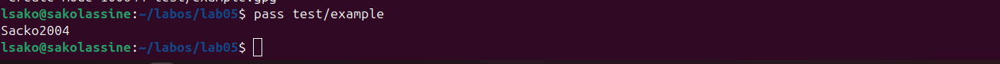

### 13. Различия chezmoi

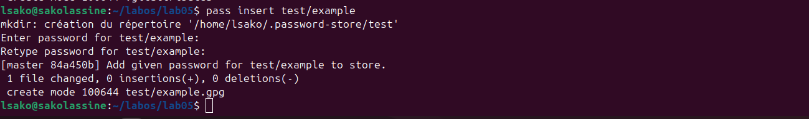

### 14. Создание bash_aliases

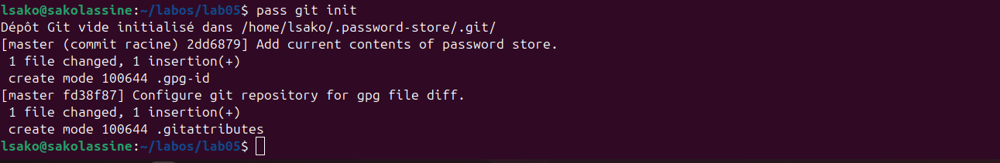

### 15. Добавление файла

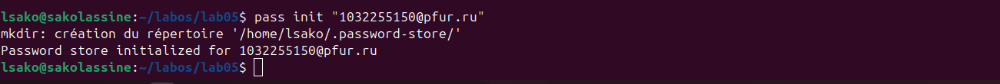

### 16. Применение конфигурации

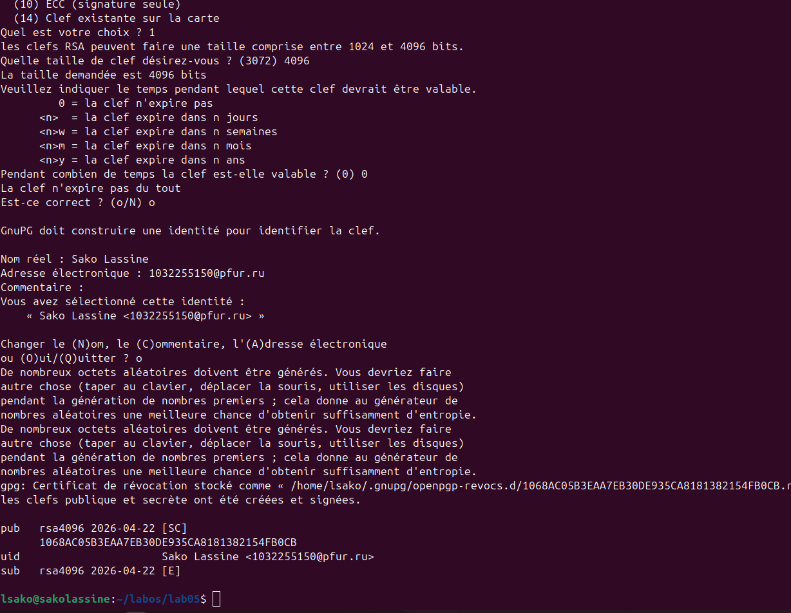

### 17. Проверка файла

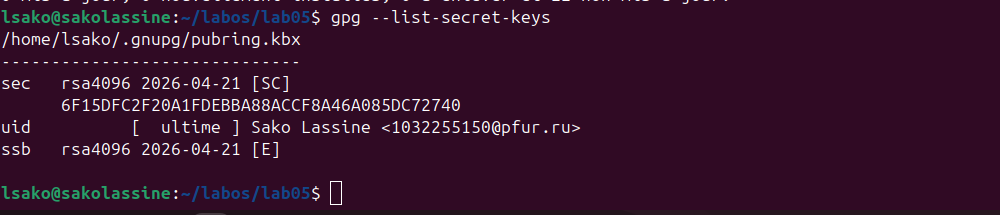

### 18. Git commit

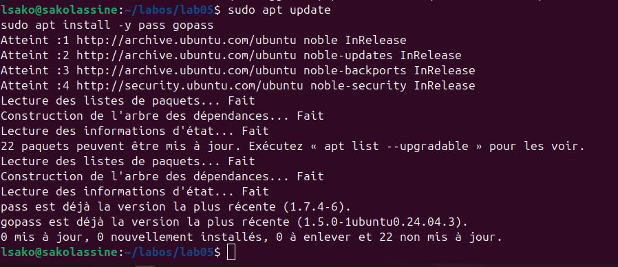

### 19. Git push

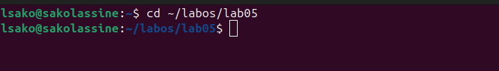

---

## Выводы

В ходе выполнения лабораторной работы были получены навыки работы с pass и chezmoi.

---

## Ответы на контрольные вопросы

### 1. Что такое pass?

Pass — стандартный менеджер паролей для Unix.

### 2. Как инициализировать pass?

```bash
pass init <email>

### 3. Как добавить пароль?

```bash
pass insert <путь/к/файлу>

# Пример:
pass insert test/example

### 4. Что такое chezmoi?

**chezmoi** — это инструмент для управления файлами конфигурации (dotfiles) на нескольких машинах. Он позволяет синхронизировать и применять настройки с помощью шаблонов и Git.

### 5. Как применить конфигурацию chezmoi?

```bash
chezmoi apply -v

# Опции:
# -v         подробный вывод (verbose)
# --dry-run  просмотреть изменения без применения

## Заключение

Лабораторная работа выполнена в полном объёме. Освоены инструменты **pass** для управления паролями и **chezmoi** для управления dotfiles.
