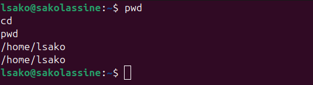
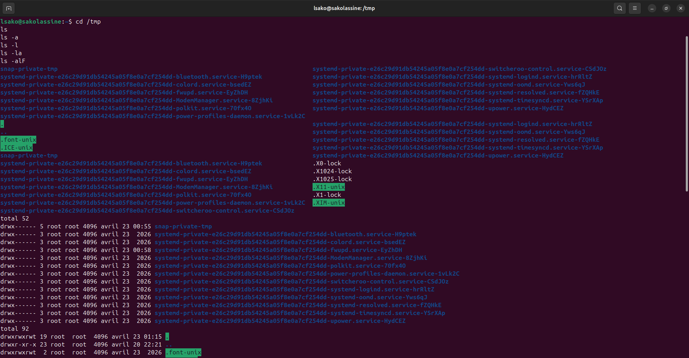
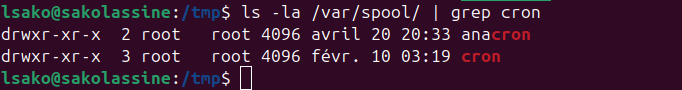
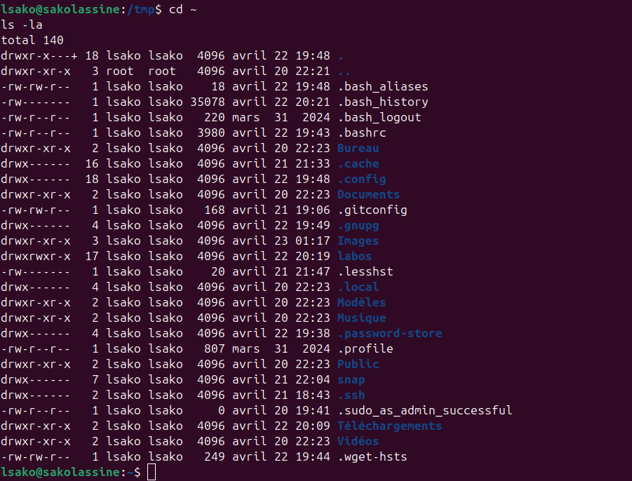
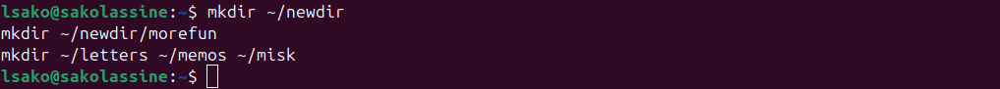
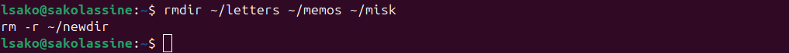
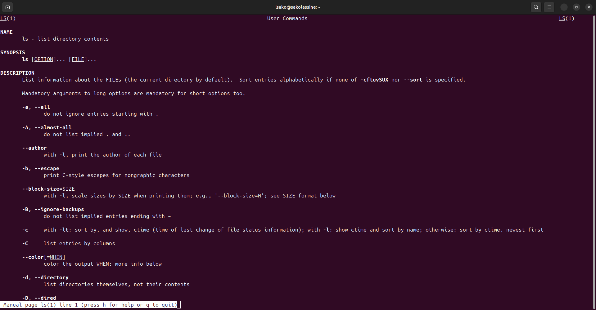
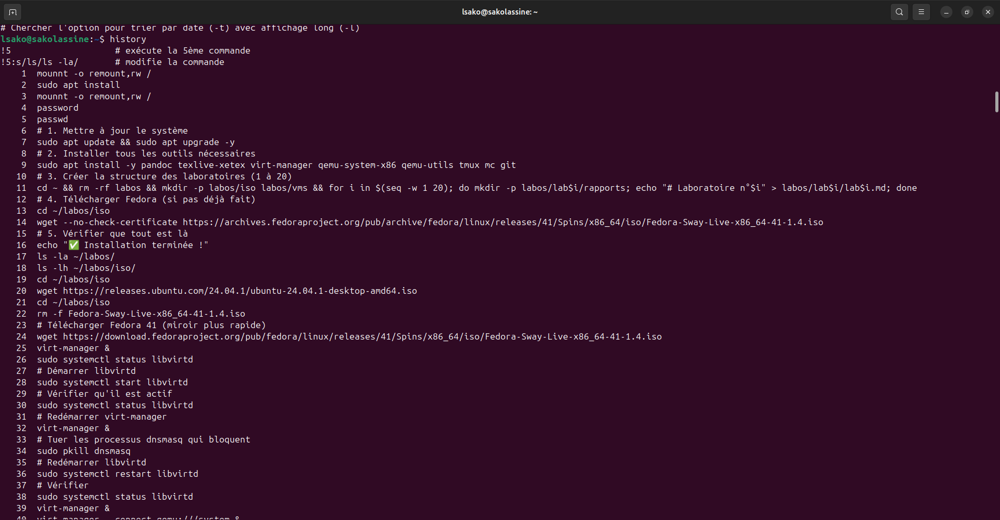

# Лабораторная работа №6: Основы интерфейса взаимодействия пользователя с системой Unix на уровне командной строки

**Студент:** САКО ЛАССИНЕ  
**Группа:** НПИБД-02-25  
**Дата выполнения:** 23.04.2026

---

## Цель работы

Приобретение практических навыков взаимодействия пользователя с системой посредством командной строки.

---

## Ход выполнения работы

### 1. Определение полного имени домашнего каталога



### 2. Работа с каталогом /tmp



### 3. Проверка наличия каталога cron



### 4. Просмотр содержимого домашнего каталога



### 5. Создание каталогов



### 6. Удаление каталогов



### 7. Использование команды man



### 8. Работа с историей команд



---

## Выводы

В ходе выполнения лабораторной работы были получены навыки работы с командами Linux: cd, ls, mkdir, rmdir, rm, man, history.

---

## Ответы на контрольные вопросы

### 1. Что такое командная строка?

Командная строка — интерфейс взаимодействия пользователя с системой через текстовые команды.

### 2. Что такое команда man?

`man` — команда для просмотра справочной информации о других командах.

### 3. Какие опции команды ls существуют?

- `-a` — показать все файлы, включая скрытые
- `-l` — подробный вывод
- `-F` — отображение типов файлов
- `-R` — рекурсивный просмотр
- `-t` — сортировка по времени

### 4. Как создать каталог?

```bash
mkdir имя_каталога


### 6. Как просмотреть историю команд?

```bash
history

### 7. Как выполнить команду из истории?

```bash
!<номер_команды>

### 8. Как модифицировать команду из истории?

```bash
!<номер_команды>:s/старое/новое/

## Заключение

Лабораторная работа выполнена в полном объёме.
