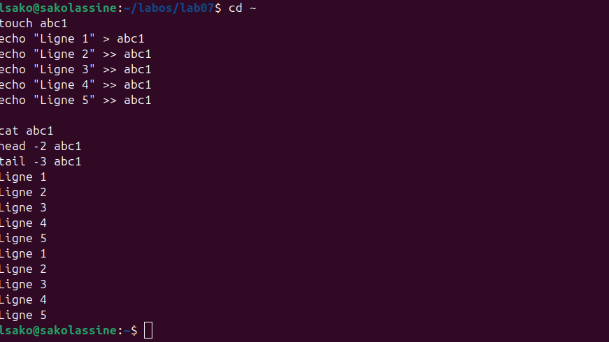
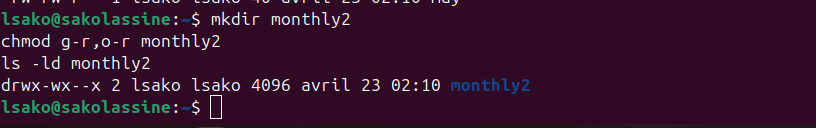
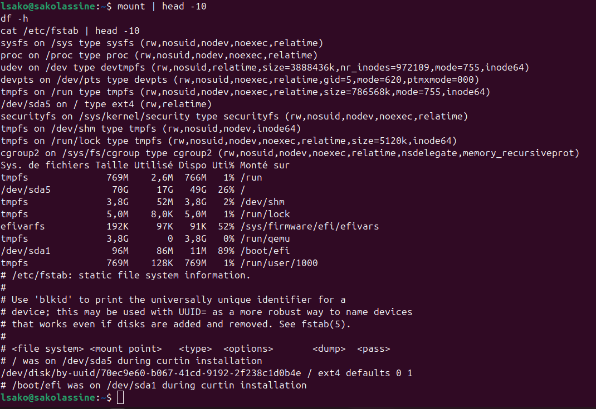
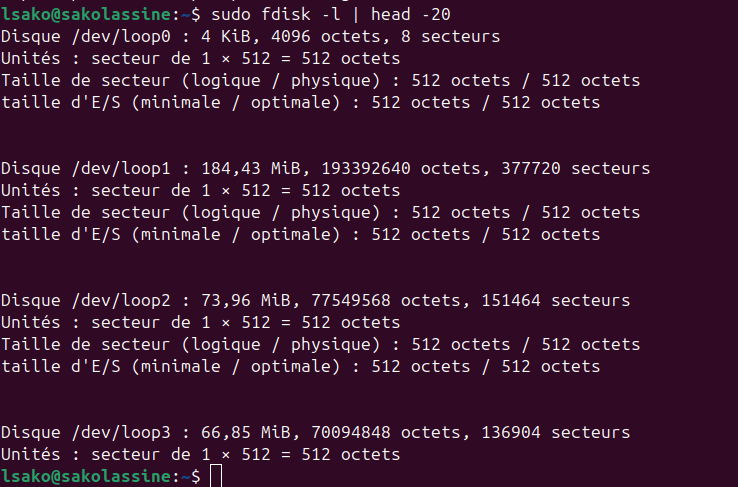

# Лабораторная работа №7: Анализ файловой системы Linux. Команды для работы с файлами и каталогами

**Студент:** САКО ЛАССИНЕ  
**Группа:** НПИБД-02-25  
**Дата выполнения:** 23.04.2026

---

## Цель работы

Ознакомление с файловой системой Linux, её структурой, именами и содержанием каталогов. Приобретение практических навыков по применению команд для работы с файлами и каталогами, по управлению процессами, по проверке использования диска и обслуживанию файловой системы.

---

## Ход выполнения работы

### 1. Создание текстового файла и просмотр содержимого



### 2. Копирование файлов


### 3. Рекурсивное копирование каталогов


### 4. Перемещение и переименование файлов и каталогов


### 5. Изменение прав доступа


### 6. Создание каталога с определёнными правами



### 7. Анализ файловой системы



### 8. Просмотр информации о дисках



---

## Выводы

В ходе выполнения лабораторной работы были получены навыки работы с командами: touch, cat, head, tail, cp, cp -r, mv, chmod, mount, df, fdisk.

---

## Ответы на контрольные вопросы

### 1. Какие команды используются для создания текстовых файлов?

- `touch <имя_файла>` — создание пустого файла
- `echo "текст" > <имя_файла>` — создание файла с содержимым

### 2. Как просмотреть содержимое файла?

- `cat <имя_файла>` — вывод всего содержимого
- `head -n <имя_файла>` — вывод первых n строк
- `tail -n <имя_файла>` — вывод последних n строк

### 3. Как скопировать файл?

```bash
cp <исходный_файл> <целевой_файл>


### 4. Как скопировать каталог с содержимым?

```bash
cp -r <исходный_каталог> <целевой_каталог>

### 5. Как переместить или переименовать файл?

```bash
mv <старое_имя> <новое_имя>      # переименование
mv <файл> <каталог>/             # перемещение


### 6. Что такое права доступа?

Права доступа определяют, кто может читать (r), записывать (w) и выполнять (x) файл или каталог.

### 7. Как изменить права доступа?

```bash
chmod u+x <файл>        # добавить выполнение для владельца
chmod g-w <файл>        # убрать запись для группы
chmod 755 <файл>        # установить права rwxr-xr-x

### 8. Как посмотреть смонтированные файловые системы?

```bash
mount
df -h


### 9. Как посмотреть информацию о дисках?

```bash
sudo fdisk -l
lsblk

## Заключение

Лабораторная работа выполнена в полном объёме.
