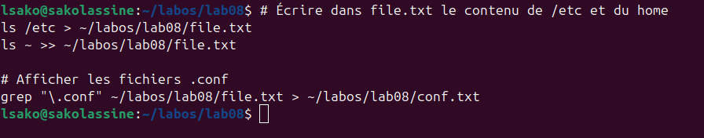
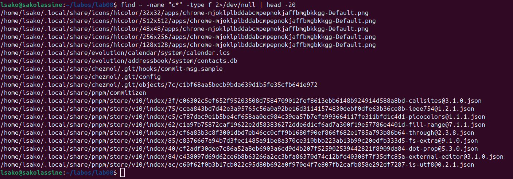
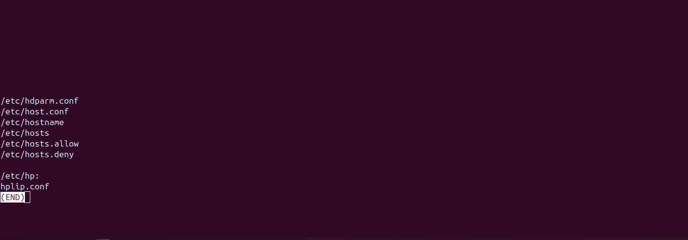
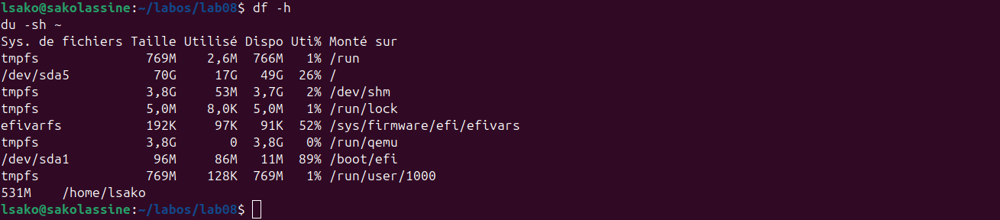
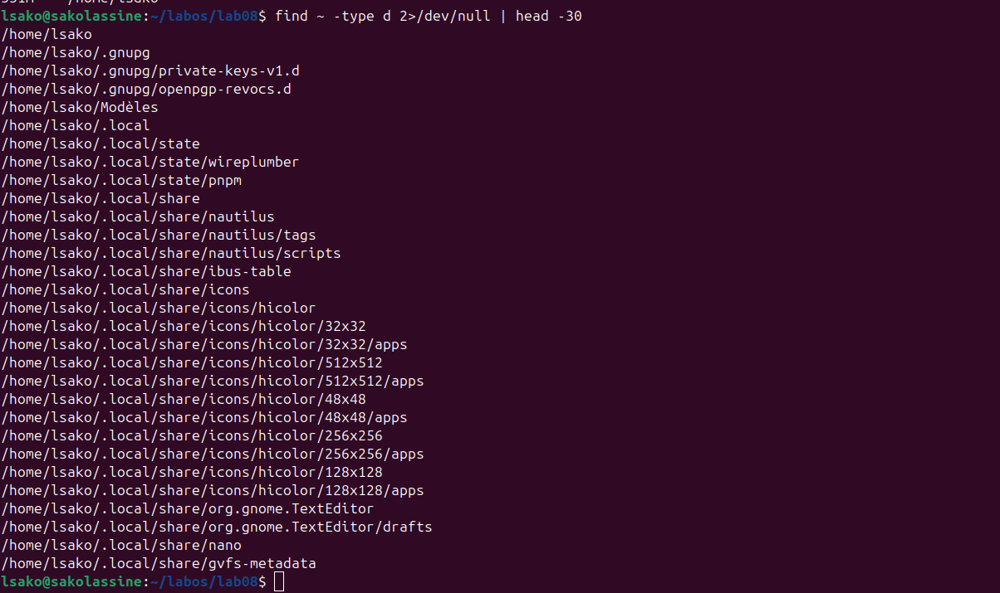

# Лабораторная работа №8: Поиск файлов. Перенаправление ввода-вывода. Просмотр запущенных процессов

**Студент:** САКО ЛАССИНЕ  
**Группа:** НПИБД-02-25  
**Дата выполнения:** 23.04.2026

---

## Цель работы

Ознакомление с инструментами поиска файлов и фильтрации текстовых данных. Приобретение практических навыков: по управлению процессами (и заданиями), по проверке использования диска и обслуживанию файловых систем.

---

## Ход выполнения работы

### 1. Перенаправление ввода-вывода



### 2. Поиск файлов, начинающихся на c



### 3. Просмотр файлов /etc, начинающихся на h



### 4. Запуск процесса в фоновом режиме


### 5. Удаление файла logfile


### 6. Запуск nano в фоновом режиме


### 7. Определение PID процесса


### 8. Завершение процесса


### 9. Анализ использования диска



### 10. Поиск всех каталогов в домашней директории



---

## Выводы

В ходе выполнения лабораторной работы были получены навыки работы с перенаправлением ввода-вывода, поиском файлов (find), фильтрацией текста (grep), управлением фоновыми процессами (jobs, kill), анализом дискового пространства (df, du).

---

## Ответы на контрольные вопросы

### 1. Какие потоки ввода-вывода вы знаете?

- `stdin` (0) — стандартный ввод (клавиатура)
- `stdout` (1) — стандартный вывод (консоль)
- `stderr` (2) — стандартный вывод ошибок (консоль)

### 2. Объясните разницу между операцией `>` и `>>`

- `>` — перенаправление вывода в файл (перезапись)
- `>>` — перенаправление вывода в файл (добавление в конец)

### 3. Что такое конвейер?

Конвейер (`|`) — механизм, передающий вывод одной команды на ввод другой.

### 4. Что такое процесс?

Процесс — это программа в момент выполнения.

### 5. Что такое PID и GID?

- `PID` — идентификатор процесса
- `GID` — идентификатор группы

### 6. Что такое задачи и какая команда позволяет ими управлять?

Задачи (jobs) — фоновые процессы. Команда `jobs` выводит список задач.

### 7. Функции утилит top и htop?

`top` и `htop` — показывают активные процессы в реальном времени.

### 8. Команда поиска файлов find

```bash
find <путь> [-опции]


### 9. Можно ли найти файл по содержанию?

Да, с помощью `grep -r "текст" <путь>`.

### 10. Как определить объём свободной памяти на диске?

```bash
df -h

### 11. Как определить объём домашнего каталога?

```bash
du -sh ~

### 12. Как удалить зависший процесс?

```bash
ps aux | grep <имя>
kill -9 <PID>

## Заключение

Лабораторная работа выполнена в полном объёме.
