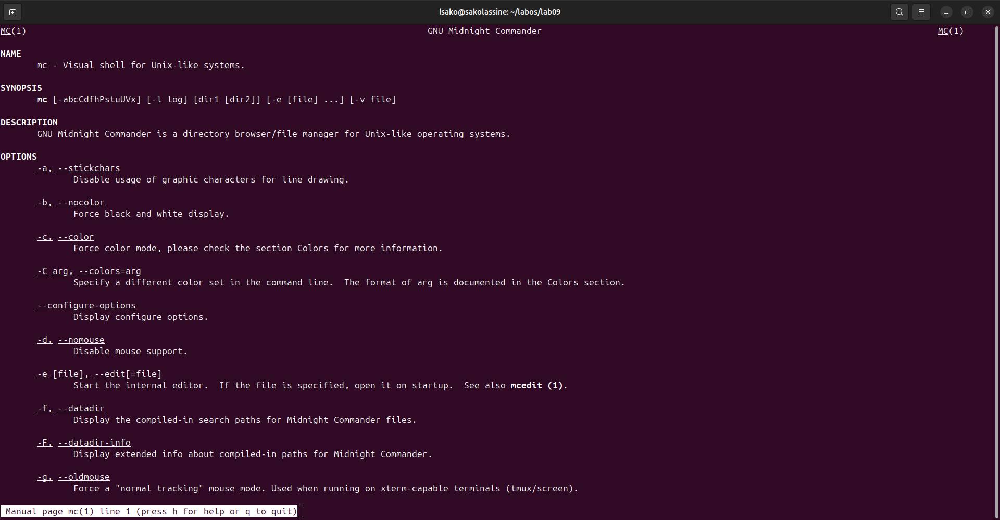
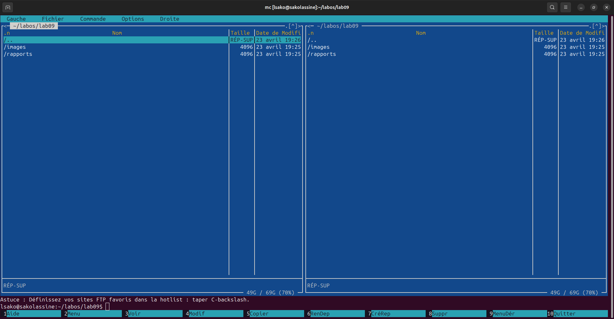
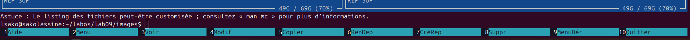
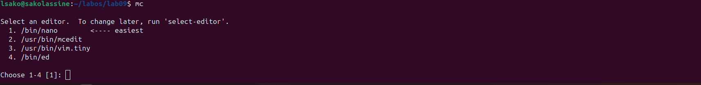
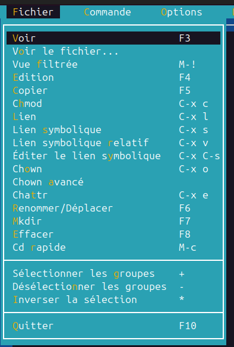
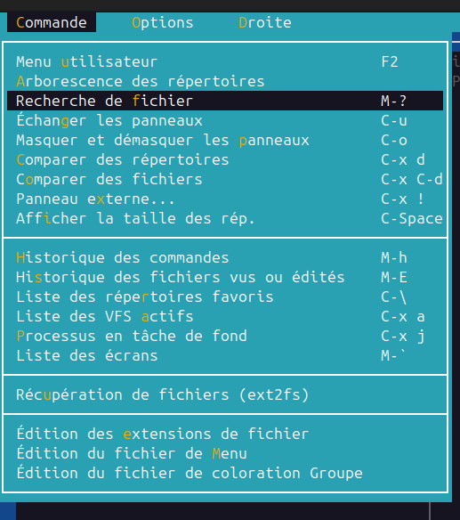

# Лабораторная работа №9: Командная оболочка Midnight Commander

**Студент:** САКО ЛАССИНЕ  
**Группа:** НПИБД-02-25  
**Дата выполнения:** 23.04.2026

---

## Цель работы

Освоение основных возможностей командной оболочки Midnight Commander. Приобретение навыков практической работы по просмотру каталогов и файлов; манипуляций с ними.

---

## Ход выполнения работы

### 1. Изучение документации

### 2. Запуск Midnight Commander

### 3. Основные операции с файлами в mc

- `F5` — копирование файлов
- `F6` — перемещение файлов
- `F7` — создание каталога
- `F8` — удаление файлов
- `F10` — выход из mc

### 4. Встроенный редактор mc

### 5. Меню Файл

### 6. Меню Команда

---

## Выводы

В ходе выполнения лабораторной работы были получены навыки работы с Midnight Commander, изучены основные функциональные клавиши, операции с файлами и каталогами, а также встроенный редактор.

---

## Ответы на контрольные вопросы

### 1. Режимы работы в mc

- **Панельный режим** — две панели для работы с файлами
- **Режим информации** — отображение информации о файле и файловой системе
- **Режим дерева** — отображение структуры каталогов
- **Режим редактора** — редактирование файлов

### 2. Операции с файлами в mc

| Команда | Действие |
|---------|----------|
| `F5` | Копирование |
| `F6` | Перемещение |
| `F7` | Создание каталога |
| `F8` | Удаление |

### 3. Структура меню панелей

- **Левая панель** / **Правая панель** — настройка отображения панелей
- **Файл** — операции с файлами
- **Команда** — системные команды
- **Настройки** — конфигурация mc

### 4. Структура меню Файл

- Копирование (`F5`)
- Перемещение (`F6`)
- Создание каталога (`F7`)
- Удаление (`F8`)
- Редактировать (`F4`)
- Права доступа (`Ctrl-x` `c`)

### 5. Структура меню Команда

- Дерево каталогов
- Поиск файла
- Переставить панели (`Ctrl-u`)
- Сравнить каталоги
- История командной строки

### 6. Структура меню Настройки

- Конфигурация
- Внешний вид
- Подтверждение
- Раскладка клавиш
- Виртуальная ФС

### 7. Встроенные команды mc

- `F1` — справка
- `F2` — пользовательское меню
- `F3` — просмотр файла
- `F4` — редактирование
- `F5` — копирование
- `F6` — перемещение
- `F7` — создание каталога
- `F8` — удаление
- `F9` — меню
- `F10` — выход

### 8. Команды встроенного редактора mc

- `F2` — сохранить
- `F7` — поиск
- `F8` — замена
- `F10` — выход

### 9. Средства создания меню пользователя

- `F2` — вызов пользовательского меню
- Редактирование файла `~/.mc/menu`

### 10. Средства выполнения действий над текущим файлом

- Контекстное меню (`F9` → Файл)
- Функциональные клавиши (`F5`-`F8`)

---

## Заключение

Лабораторная работа выполнена в полном объёме.

