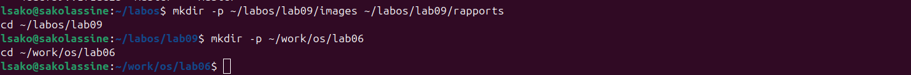
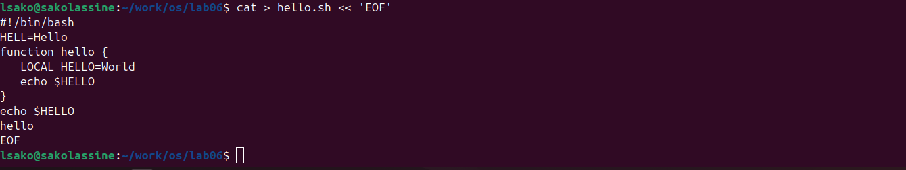
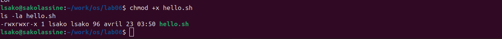
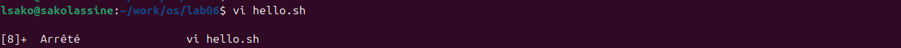

---

# Лабораторная работа №10: Текстовой редактор vi

**Студент:** САКО ЛАССИНЕ  
**Группа:** НПИБД-02-25  
**Дата выполнения:** 23.04.2026

---

## Цель работы

Познакомиться с операционной системой Linux. Получить практические навыки работы с редактором vi, установленным по умолчанию практически во всех дистрибутивах.

---

## Ход выполнения работы

### 1. Создание каталога

### 2. Создание файла hello.sh

### 3. Предоставление прав на выполнение

### 4. Редактирование файла

### 5. Выполнение скрипта

---

## Выводы

В ходе выполнения лабораторной работы были получены навыки работы с текстовым редактором vi, изучены основные режимы работы и команды редактирования, создан и отредактирован bash-скрипт.

---

## Ответы на контрольные вопросы

### 1. Режимы работы редактора vi

- **Командный режим** — для ввода команд редактирования и навигации
- **Режим вставки** — для ввода текста
- **Режим последней строки** — для записи изменений и выхода

### 2. Как выйти из редактора без сохранения?

`:q!` — выйти без сохранения изменений

### 3. Команды позиционирования

- `0` — в начало строки
- `$` — в конец строки
- `G` — в конец файла
- `nG` — на строку n

### 4. Что для vi является словом?

Слово — это последовательность букв, цифр и символов подчёркивания.

### 5. Как перейти в начало/конец файла?

- Начало файла: `gg` или `1G`
- Конец файла: `G`

### 6. Основные команды редактирования

- `i` — вставка перед курсором
- `a` — вставка после курсора
- `x` — удаление символа
- `dd` — удаление строки
- `dw` — удаление слова
- `u` — отмена действия

### 7. Заполнение строки символами $

В режиме вставки набрать символы `$`, в командном режиме повторить с помощью `.`

### 8. Как отменить некорректное действие?

`u` — отмена последнего действия

### 9. Команды режима последней строки

- `:w` — записать файл
- `:q` — выйти
- `:wq` — записать и выйти
- `:q!` — выйти без сохранения
- `:set nu` — показать номера строк

### 10. Как определить позицию конца строки?

Переместиться в конец строки с помощью `$`

### 11. Опции редактора vi

- `:set all` — список всех опций
- `:set nu` — нумерация строк
- `:set list` — отображение невидимых символов
- `:set ic` — игнорирование регистра при поиске

### 12. Как определить режим работы vi?

- В командном режиме нельзя вводить текст
- В режиме вставки внизу экрана отображается `-- INSERT --`
- В режиме последней строки появляется двоеточие `:`

### 13. Граф взаимосвязи режимов

Командный режим ←→ Режим вставки
↓
Режим последней строки

## Заключение

Лабораторная работа выполнена в полном объёме.
