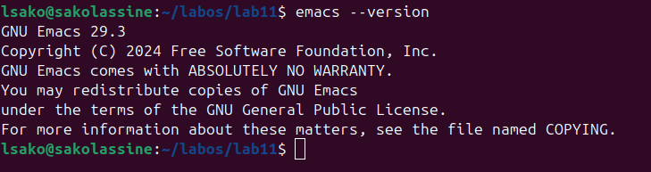
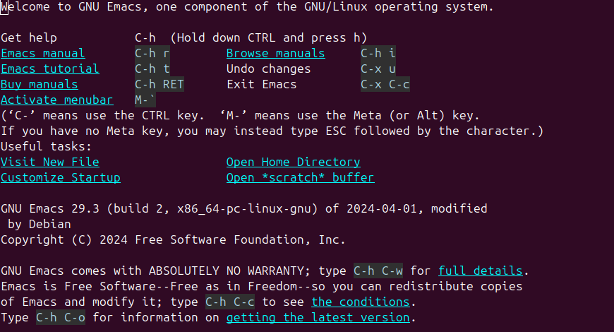
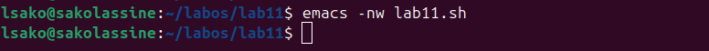
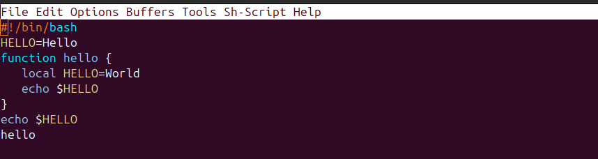
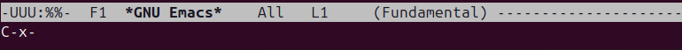
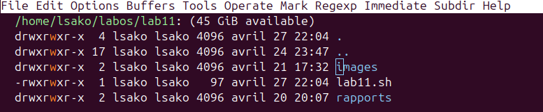
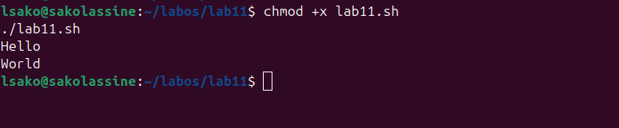

# Лабораторная работа №11: Текстовый редактор Emacs

## Цель работы

Освоение работы с текстовым редактором Emacs.

## Ход выполнения работы

### 1. Проверка версии Emacs



### 2. Запуск Emacs



### 3. Создание файла lab11.sh



### 4. Редактирование файла



### 5. Сохранение файла



### 6. Выход из Emacs



### 7. Выполнение скрипта

```bash
chmod +x lab11.sh
./lab11.sh


Результат:

Hello
World




## Выводы

Основные команды Emacs освоены:

- `C-x C-f` — открыть/создать файл
- `C-x C-s` — сохранить
- `C-x C-c` — выход

## Контрольные вопросы

### 1. Кратко охарактеризуйте редактор emacs.

Emacs — это мощный, расширяемый текстовый редактор с поддержкой множества режимов (программирование, разметка, работа с файлами). Он имеет встроенную справку, поддержку макросов, работу с буферами и окнами.

### 2. Какие особенности редактора могут сделать его сложным для новичка?

- Комбинации клавиш (Ctrl+x Ctrl+s, Ctrl+x Ctrl+c)
- Три режима работы (командный, вставки, Emacs-lisp)
- Отсутствие явного меню (по умолчанию)
- Использование мета-клавиш (Alt / Esc)
- Команды через M-x

### 3. Своими словами объясните, что такое буфер и окно в терминологии Emacs?

- **Буфер** — область в памяти, содержащая текст (файл, результат команды, сообщение).
- **Окно** — область экрана, отображающая содержимое буфера. Можно разделить на несколько окон.

### 4. Можно ли открыть больше 10 буферов в одном окне?

Да, можно открыть любое количество буферов. Окно отображает один активный буфер, но переключаться между ними можно через `C-x b` или `C-x C-b`.

### 5. Какие буферы создаются по умолчанию при запуске Emacs?

- `*scratch*` — для временного ввода и выполнения Elisp-кода
- `*Messages*` — системные сообщения
- `*GNU Emacs*` — приветственный буфер
- `*Backtrace*` — при ошибках

### 6. Какие клавиши вы нажмёте, чтобы ввести следующую комбинацию: `C-c |` и `C-c C-|`?

- `C-c |` — нажать Ctrl+c, затем `|`
- `C-c C-|` — нажать Ctrl+c, затем Ctrl+`|`

### 7. Как поделить текущее окно на две части?

- `C-x 2` — разделить по горизонтали
- `C-x 3` — разделить по вертикали

### 8. В каком файле хранятся настройки редактора emacs?

Настройки хранятся в файле `~/.emacs` или `~/.emacs.d/init.el`.

### 9. Какую функцию выполняет клавиша `|`? Можно ли её переназначить?

Клавиша `|` обычно выполняет команду `shell-command-on-region` (передать выделенный текст внешней команде). Да, можно переназначить через `global-set-key`.

### 10. Какой редактор вам показался удобнее в работе: vi или emacs? Почему?

*(Ответ студента)*  
Пример: Emacs удобнее благодаря встроенной справке, меню и более интуитивным комбинациям. Vi быстрее для простого редактирования в терминале.


## Заключение

Лабораторная работа выполнена в полном объёме.
