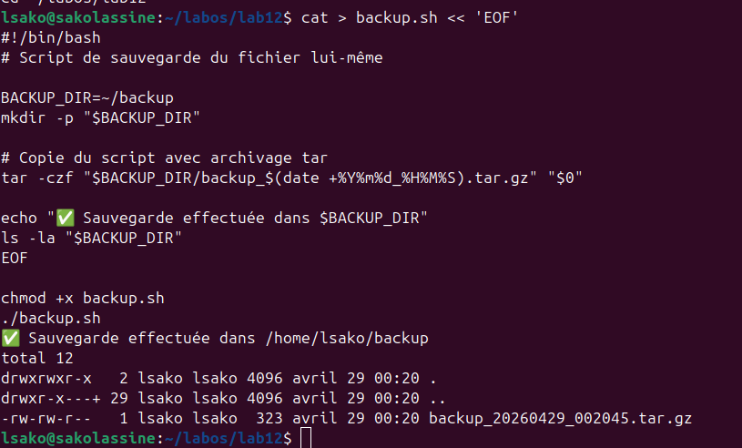
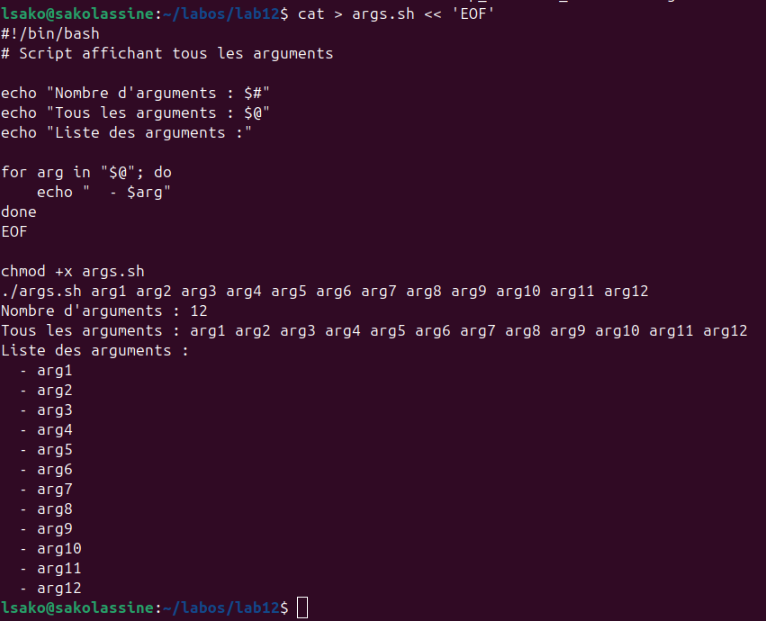
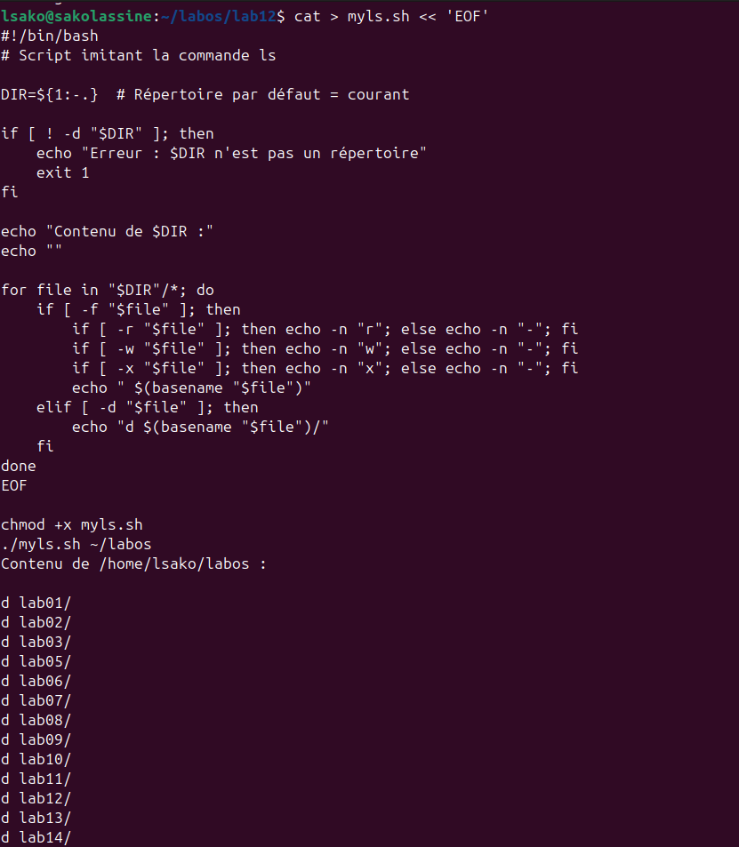
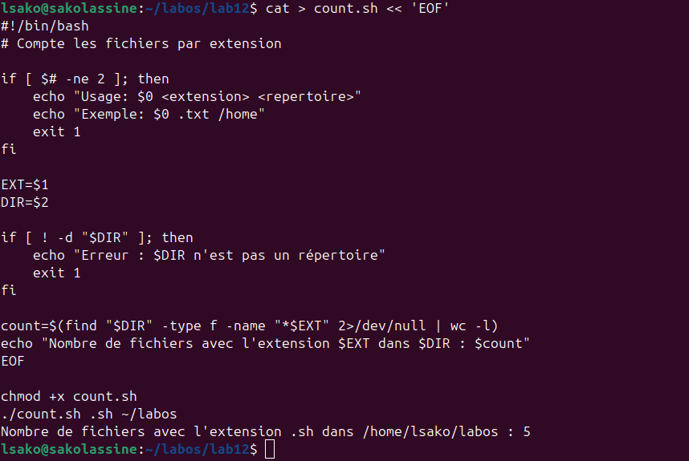

# Лабораторная работа №12: Программирование в командном процессоре ОС UNIX

## Цель работы

Изучение основ программирования в оболочке Bash. Освоение написания скриптов для автоматизации задач.

## Ход выполнения работы

### 1. Скрипт резервного копирования (backup.sh)



### 2. Скрипт обработки аргументов (args.sh)



### 3. Скрипт-аналог команды ls (myls.sh)



### 4. Скрипт подсчёта файлов по расширению (count.sh)



## Результаты выполнения

| Скрипт | Описание | Результат |
|--------|----------|-----------|
| `backup.sh` | Резервное копирование | ✅ Архив создан |
| `args.sh` | Обработка аргументов | ✅ 12 аргументов |
| `myls.sh` | Аналог ls | ✅ Список каталогов |
| `count.sh` | Подсчёт по расширению | ✅ 5 файлов .sh |

## Выводы

В ходе выполнения лабораторной работы были освоены:
- Создание резервных копий с помощью `tar`
- Обработка аргументов командной строки (`$#`, `$@`, `$*`)
- Использование циклов `for` и условных операторов `if`
- Поиск файлов с помощью `find`
- Проверка прав доступа (`-r`, `-w`, `-x`, `-f`, `-d`)

## Контрольные вопросы

### 1. Объясните понятие командной оболочки. Приведите примеры командных оболочек. Чем они отличаются?

Командная оболочка (shell) — программа, обеспечивающая интерфейс между пользователем и ОС. Примеры: sh, bash, csh, zsh. Отличаются синтаксисом и функциями.

### 2. Что такое POSIX?

POSIX — набор стандартов для совместимости UNIX-подобных систем.

### 3. Как определяются переменные и массивы в языке программирования bash?

```bash
name="value"
set -A array a b c
echo ${array[0]}

### 4. Каково назначение операторов let и read?

- `let` — арифметические вычисления
- `read` — чтение ввода пользователя

### 5. Какие арифметические операции можно применять в языке программирования bash?

`+`, `-`, `*`, `/`, `%`, `**`, `+=`, `-=`, `*=`, `/=`, `%=`

### 6. Что означает операция `(( ))`?

Арифметические вычисления и выполнение выражений.

### 7. Какие стандартные имена переменных Вам известны?

`PATH`, `HOME`, `PS1`, `PS2`, `IFS`, `MAIL`, `TERM`, `LOGNAME`

### 8. Что такое метасимволы?

Символы со специальным значением: `*`, `?`, `[]`, `|`, `>`, `<`, `&`, `;`

### 9. Как экранировать метасимволы?

- `\` — экранирование одного символа
- `'...'` — экранирование строки
- `"..."` — частичное экранирование

### 10. Как создавать и запускать командные файлы?

```bash
nano script.sh
chmod +x script.sh
./script.sh

### 11. Как определяются функции в языке программирования bash?

```bash
function name {
    commands
}

### 12. Каким образом можно выяснить, является файл каталогом или обычным файлом?

- `[ -d "$file" ]` — проверка, является ли файл каталогом
- `[ -f "$file" ]` — проверка, является ли файл обычным файлом

### 13. Каково назначение команд set, typeset и unset?

- `set` — установка параметров
- `typeset` — объявление типа переменной
- `unset` — удаление переменной

### 14. Как передаются параметры в командные файлы?

```bash
./script.sh arg1 arg2
# $1, $2, $#, $@

### 15. Назовите специальные переменные языка bash и их назначение.

| Переменная | Назначение |
|------------|------------|
| `$0` | Имя скрипта |
| `$1-$9` | Позиционные параметры |
| `$#` | Количество аргументов |
| `$@` | Все аргументы |
| `$?` | Код завершения |
| `$$` | PID процесса |
| `$!` | PID фонового процесса |

---

## Заключение

Лабораторная работа выполнена в полном объёме.
