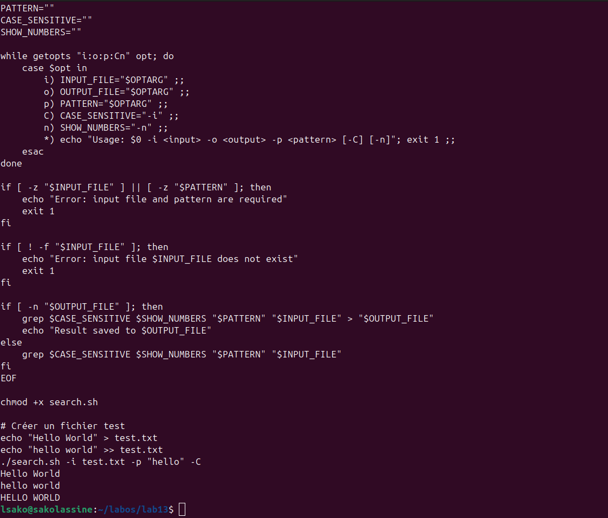
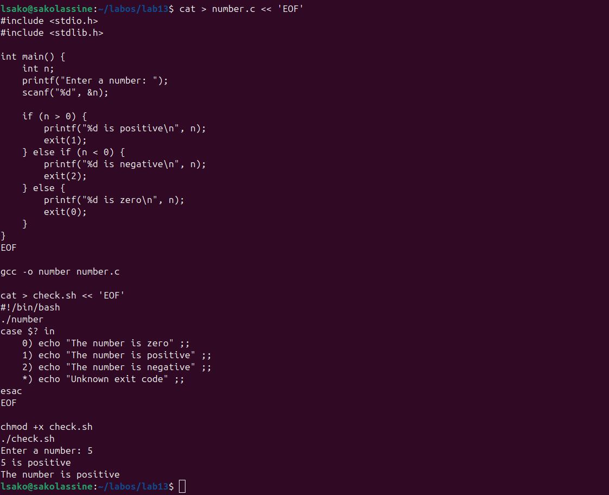
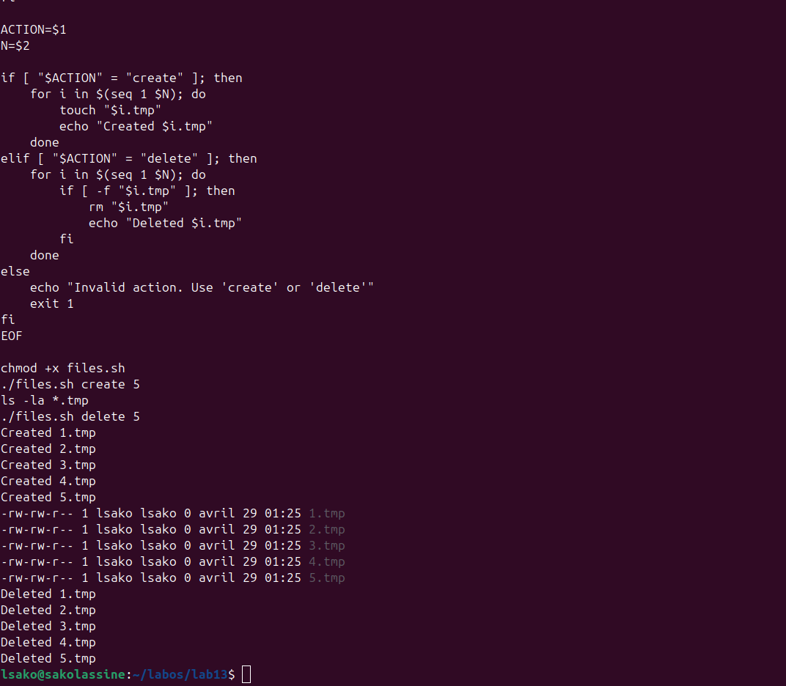
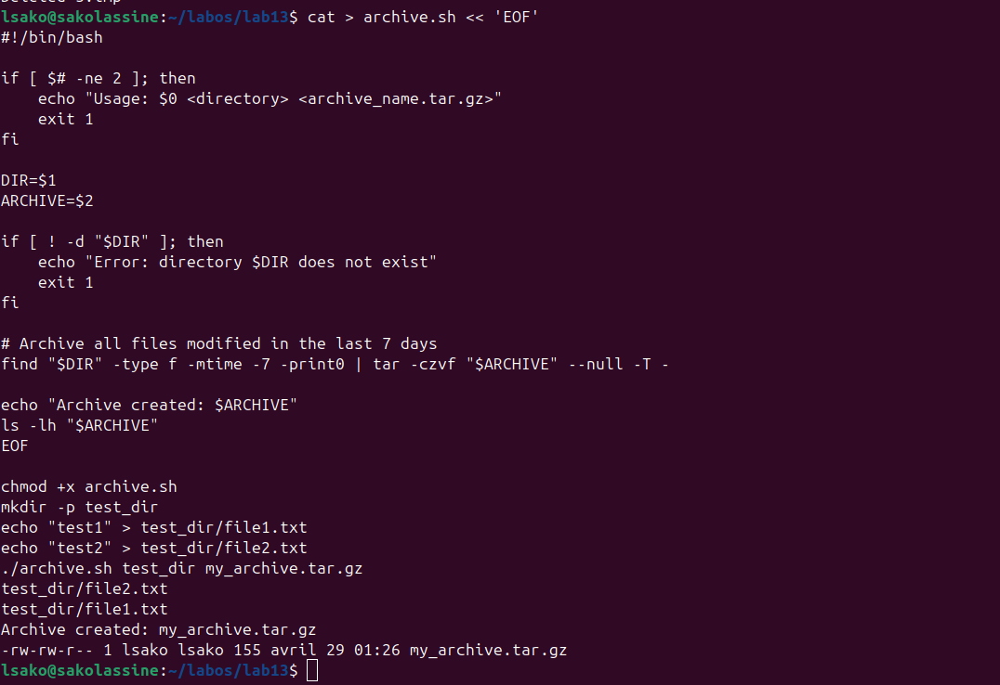

# Лабораторная работа №13: Программирование в командном процессоре ОС UNIX. Ветвления и циклы

## Цель работы

Изучение основ программирования в оболочке ОС UNIX. Освоение написания командных файлов с использованием логических управляющих конструкций и циклов.

## Ход выполнения работы

### 1. Скрипт с getopts (search.sh)

### 2. Программа на C и анализ кода возврата

### 3. Скрипт создания и удаления файлов (files.sh)

### 4. Скрипт архивации (archive.sh)

## Контрольные вопросы

### 1. Каково предназначение команды getopts?

Команда getopts используется для анализа аргументов командной строки. Она позволяет обрабатывать опции (флаги) и их аргументы. Синтаксис: `getopts optstring variable`

### 2. Какое отношение метасимволы имеют к генерации имён файлов?

Метасимволы (`*`, `?`, `[]`) используются для шаблонного поиска файлов. Например, `*.txt` соответствует всем файлам с расширением .txt.

### 3. Какие операторы управления действиями вы знаете?

- `if-then-else-fi` - условный оператор
- `case-esac` - оператор выбора
- `for-do-done` - цикл со счётчиком
- `while-do-done` - цикл с предусловием
- `until-do-done` - цикл с постусловием

### 4. Какие операторы используются для прерывания цикла?

- `break` - прерывает выполнение цикла
- `continue` - прерывает текущую итерацию и переходит к следующей

### 5. Для чего нужны команды false и true?

- `true` - всегда возвращает код завершения 0 (истина)
- `false` - всегда возвращает код завершения 1 (ложь)
Используются для создания бесконечных циклов и условных проверок.

### 6. Что означает строка `if test -f man\$s/\$i.\$s`, встреченная в командном файле?

Эта строка проверяет, существует ли файл с именем `man$s/$i.$s` и является ли он обычным файлом. Символ `\` экранирует метасимволы.

### 7. Объясните различие между конструкциями while и until.

- `while` - выполняет цикл, ПОКА условие истинно
- `until` - выполняет цикл, ПОКА условие ложно (ДО тех пор, пока не станет истинным)

## Выводы

В ходе выполнения лабораторной работы были освоены:
- Использование getopts для анализа аргументов командной строки
- Работа с кодом возврата программ на C
- Создание и удаление файлов в цикле
- Архивация файлов с помощью tar и find

## Заключение

Лабораторная работа выполнена в полном объёме.
