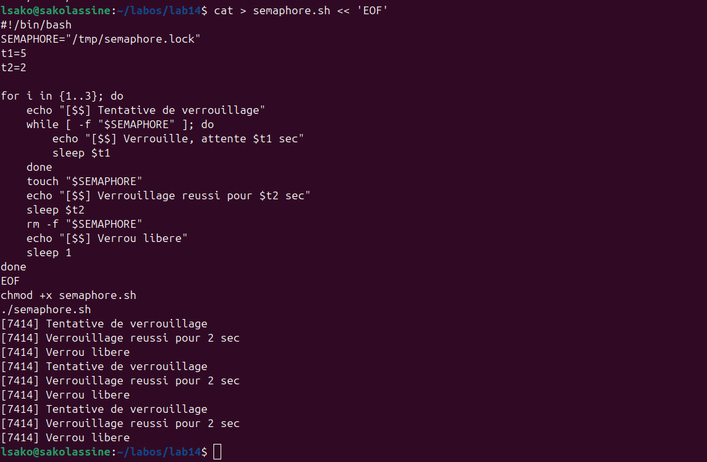
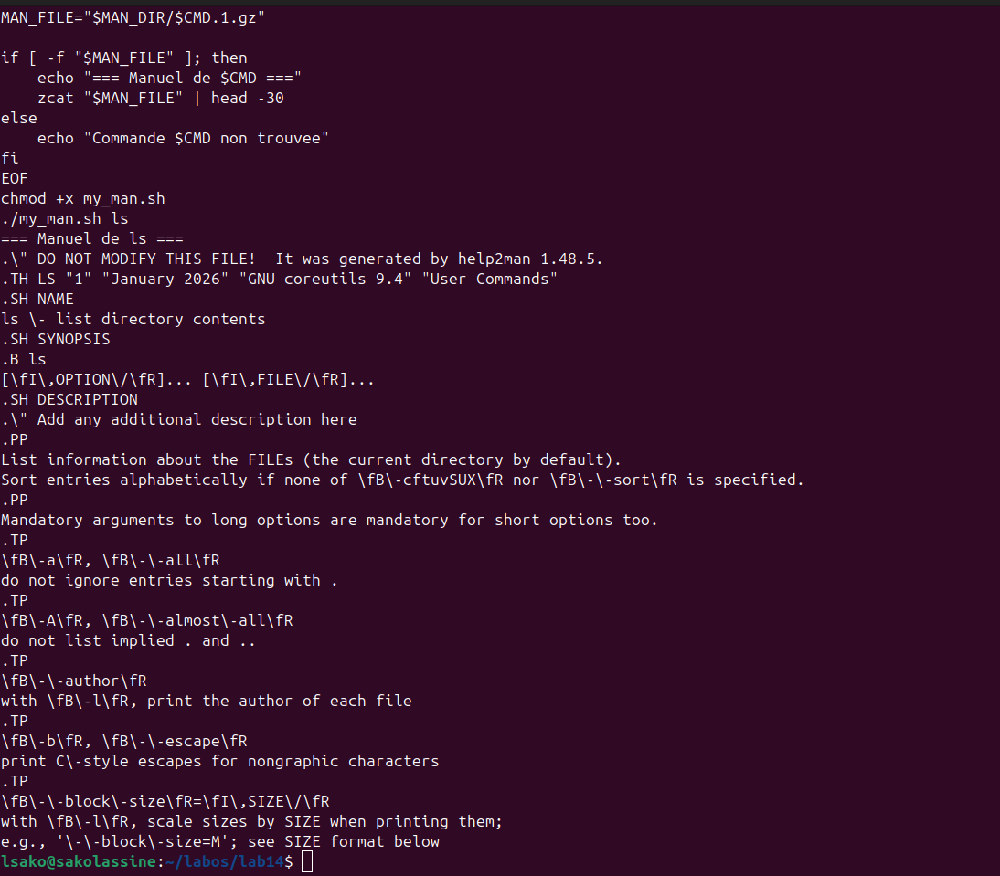
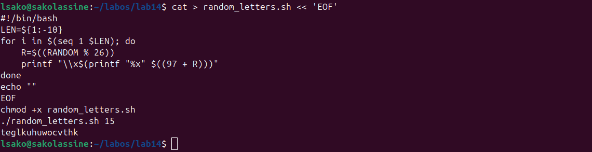

# Лабораторная работа №14

## Цель работы
Изучение программирования в оболочке ОС UNIX. Научиться писать сложные командные файлы.

## Ход выполнения работы

### 1. Семафоры (semaphore.sh)

### 2. Эмуляция man (my_man.sh)

### 3. Случайные буквы (random_letters.sh)

## Контрольные вопросы

**1. Найдите ошибку: `while [\$1 != "exit"]`**  
Ошибка: нет пробелов. Правильно: `while [ "$1" != "exit" ]`

**2. Как объединить строки?**  
`s1="Hello"; s2="World"; r="$s1$s2"`

**3. Что такое seq? Альтернативы?**  
`seq 1 10` → `{1..10}` ou `for ((i=1; i<=10; i++))`

**4. Результат `((10 / 3))`?**  
`3` (деление целых)

**5. Отличия zsh от bash?**  
Zsh: лучше автодополнение, больше возможностей.

**6. Верен ли синтаксис `for ((a=1; a <= LIMIT; a++))`?**  
Да, верен.

**7. Сравнение bash с другими языками?**  
Bash: прост для автоматизации, медленный для вычислений.

## Результаты
| Скрипт | Результат |
|--------|-----------|
| semaphore.sh | ✅ 3 цикла |
| my_man.sh | ✅ справка ls |
| random_letters.sh | ✅ 15 букв |

## Выводы
- Семафоры для синхронизации
- Эмуляция системных команд
- Génération de séquences aléatoires

## Заключение
Лабораторная работа выполнена.
