# Лабораторная работа №4: Продвинутое использование git

**Студент:** САКО ЛАССИНЕ  
**Группа:** НПИБД-02-25  
**Дата выполнения:** 21.04.2026

---

## Цель работы

Получение навыков правильной работы с репозиториями git, освоение Gitflow и Conventional Commits.

---

## Ход выполнения работы

### 1. Установка программного обеспечения

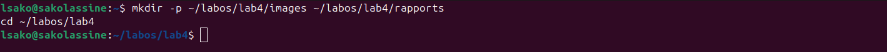

### 2. Создание репозитория на GitHub

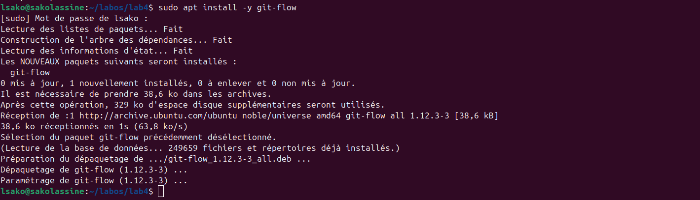

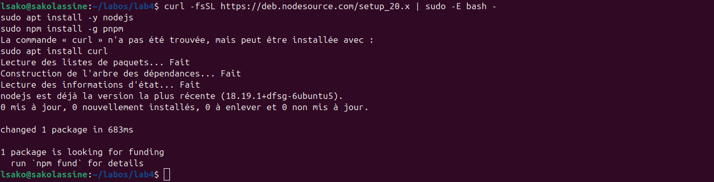

### 3. Настройка git

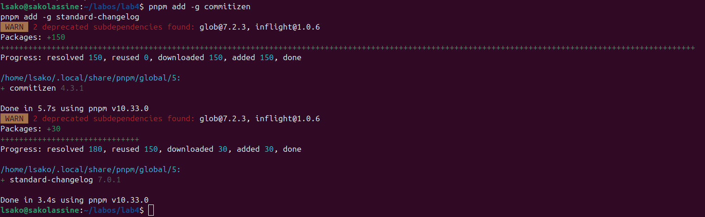

### 4. Первый коммит

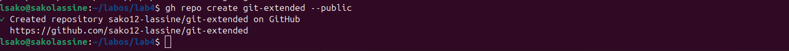

### 5. Создание package.json

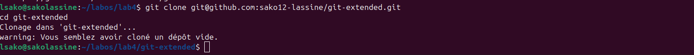

### 6. Коммит с commitizen

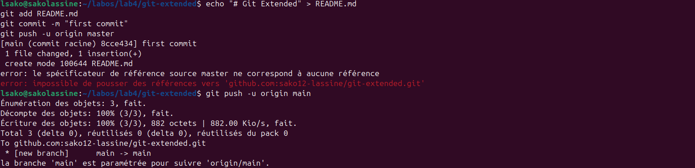

### 7. Инициализация git-flow

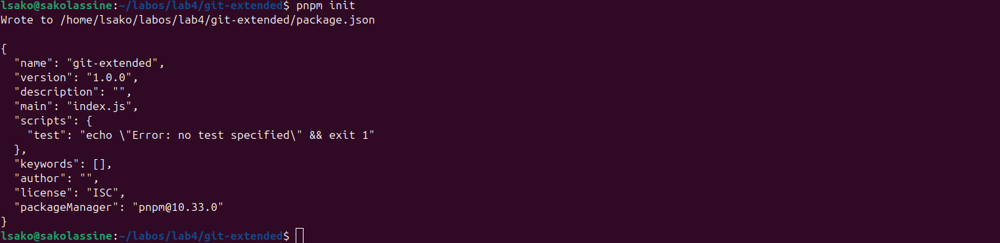

### 8. Настройка ветки develop

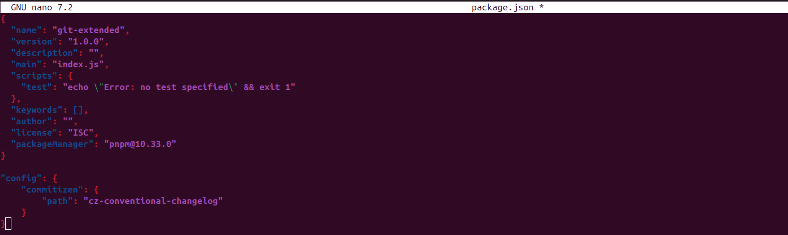

### 9. Создание релиза 1.0.0


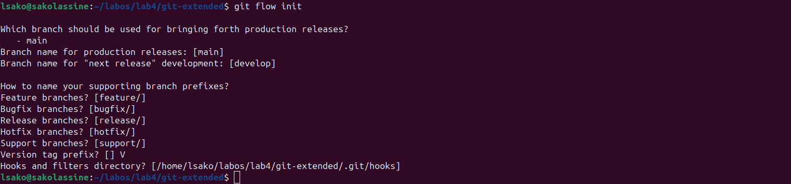

### 10. Создание feature ветки

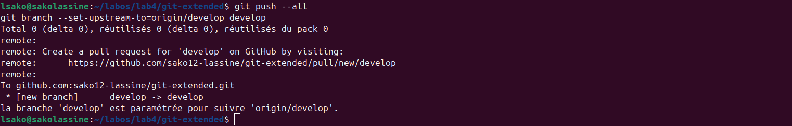

### 11. Создание релиза 1.2.3

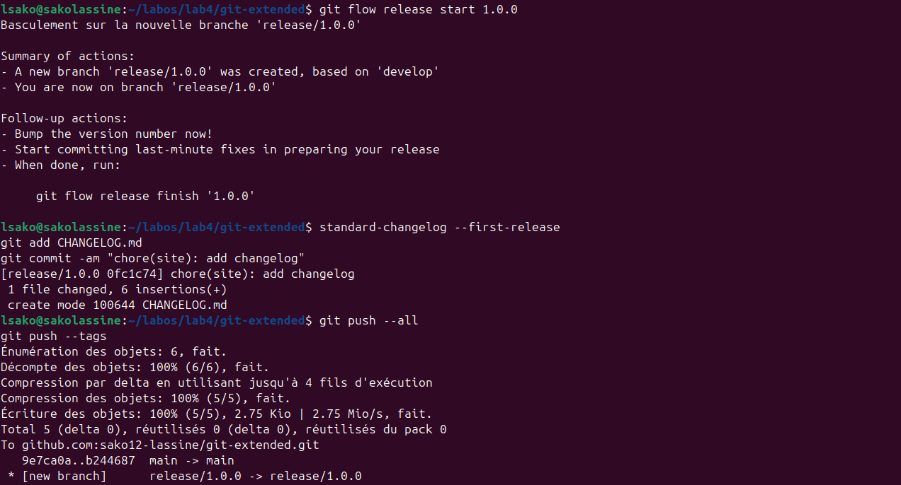

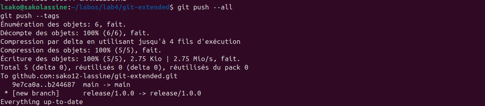

---

## Выводы

В ходе выполнения лабораторной работы были получены следующие результаты:

1. Установлены git-flow, Node.js, pnpm, commitizen, standard-changelog.
2. Создан репозиторий `git-extended-v2` на GitHub.
3. Настроены Conventional Commits с помощью commitizen.
4. Инициализирован Gitflow (ветки main, develop).
5. Созданы релизы v1.0.0 и v1.2.3.
6. Сгенерирован CHANGELOG.md с помощью standard-changelog.
7. Создана и завершена feature-ветка.
8. Созданы релизы на GitHub с помощью gh.

**Приобретённые навыки:**
- Работа с Gitflow workflow
- Семантическое версионирование
- Conventional Commits
- Автоматическая генерация журнала изменений
- Управление релизами на GitHub

---

## Ответы на контрольные вопросы

### 1. Что такое Gitflow?

Gitflow — это модель ветвления для git, которая определяет строгую структуру веток (master, develop, feature, release, hotfix).

### 2. Какие ветки существуют в Gitflow?

| Ветка | Назначение |
|-------|------------|
| `main` | Официальная история релизов |
| `develop` | Интеграционная ветка для функций |
| `feature/*` | Разработка новых функций |
| `release/*` | Подготовка релиза |
| `hotfix/*` | Срочные исправления |

### 3. Что такое Conventional Commits?

Спецификация для написания сообщений коммитов, которая определяет структуру и типы коммитов.

### 4. Какие типы коммитов существуют?

- `feat` — новая функция (MINOR)
- `fix` — исправление ошибки (PATCH)
- `BREAKING CHANGE` — несовместимые изменения (MAJOR)
- `docs` — документация
- `style` — форматирование
- `refactor` — рефакторинг
- `test` — тесты
- `chore` — обслуживание

### 5. Что такое семантическое версионирование?

Формат версии `MAJOR.MINOR.PATCH`.

### 6. Для чего нужен standard-changelog?

Автоматически генерирует CHANGELOG.md на основе Conventional Commits.

### 7. Как создать релиз в Gitflow?

```bash
git flow release start 1.0.0
standard-changelog --first-release
git add CHANGELOG.md
git commit -m "chore(site): add changelog"
git flow release finish 1.0.0
git push --all
git push --tags
gh release create v1.0.0 -F CHANGELOG.md

## Заключение

Лабораторная работа выполнена в полном объёме.
